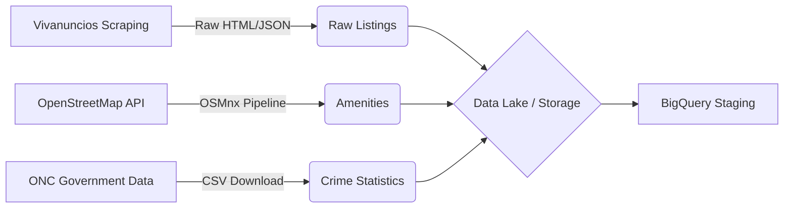

# Data Extraction Pipeline & Data Dictionary

**Phase:** 1 - ETL & Data Collection

## 1. Architecture Overview

The objective of this phase was to construct a robust dataset that captures both the market value (listings) and the urban value (context) across the 18 municipalities of Queretaro.

A Polycentric Architecture was implemented to avoid "capital-centric" bias, identifying dynamic centroids for every municipality (ranging from industrial hubs like *El Marques* to tourism centers like *Tequisquiapan*).

### Data Flow Diagram

## 2. Data Source Inventory

### A. Real Estate Listings (Target)
* **Source:** Vivanuncios (Web Scraping).
* **Path:** `data/raw/listings.csv`
* **Scope:** Residential properties (Sale) within the state.
* **Extraction Logic:** Retrieved price, surface area (sq meters), geolocation (lat/lon), and physical attributes.

### B. Urban Context (Features)
* **Source:** OpenStreetMap (OSM).
* **Path:** `data/external/amenities.csv`
* **Extraction Logic:**
    * **Approach:** Statewide extraction using a hierarchical tag dictionary.
    * **Polycentricity:** Dynamic geolocation of administrative centers for all 18 municipalities using a "Fallback Strategy" (Centroid vs. Named Node).
    * **Transformation:** Imputation of missing names and deduplication of spatial coordinates.

### C. Safety Metrics (Features)
* **Source:** Observatorio Nacional Ciudadano (ONC).
* **Path:** `data/external/onc-datos-abiertos.csv`
* **Scope:** Anual crime incidence rates aggregated by municipality.

## 3. Data Dictionary

### Table: `amenities.csv`
This dataset serves as the "Value Map" for the region. Each row represents a Point of Interest (POI) used to calculate proximity features.

| Variable | Type | Description | Example |
| :--- | :--- | :--- | :--- |
| `name` | String | Name of the establishment. Generic names were imputed if null. | "Parque Industrial Qro", "Unnamed Nature Park" |
| `category` | String | Engineering category for ML feature generation. | See Category Detail table below. |
| `latitude` | Float | Y Coordinate (WGS84). | 20.587... |
| `longitude` | Float | X Coordinate (WGS84). | -100.387... |

#### Category Details (`category`)
Tags were aggregated into high-level categories to capture specific value drivers:

* **Macro-Location (Zone Definition):**
    * `hub_industrial`: Industrial Parks (Employment drivers).
    * `hub_tourism`: Tourism attractions (key for "Pueblos Magicos").
    * `hub_commercial`: Regional Malls and Department Stores.
    * `municipal_center`: Administrative downtown (Base reference point).

* **Micro-Location (Neighborhood Quality):**
    * `nature_park` / `nature_green_area`: Formal parks vs. informal green spaces.
    * `shop_supermarket`: Major retail access (Walmart, HEB).
    * `shop_convenience`: High-frequency retail (Oxxo). Used as a proxy for urban density.
    * `education_school` / `education_university`: Educational supply.
    * `health_hospital` / `health_local`: Healthcare infrastructure hierarchy.

### Table: `onc-datos-abiertos.csv`
Crime incidence data for geospatial joins at the municipal level.

| Variable | Description |
| :--- | :--- |
| `municipio` | Municipality name (Join Key). |
| `delito` | Crime type (Robbery, Homicide, etc.). |
| `tasa` | Crime rate per 100,000 inhabitants (Normalized metric). |
| `fecha` | Reporting period (YYYY-MM). |

## 4. Engineering Decisions & Technical Notes

1.  **Null Handling Strategy:** POIs with missing `name` tags were retained and labeled (e.g., "Unnamed Park").
    * *Rationale:* For a spatial valuation model, the physical existence and location of an amenity are more critical than its commercial name.
2.  **Brand Normalization:** High-frequency entities with inconsistent tagging (e.g., "Oxo", "OXXO") were standardized to a single label to ensure data consistency.
3.  **Directory Structure:** The project follows the Cookiecutter Data Science standard:
    * `data/raw/`: Immutable business data (Listings).
    * `data/external/`: Third-party contextual data (OSM, ONC).